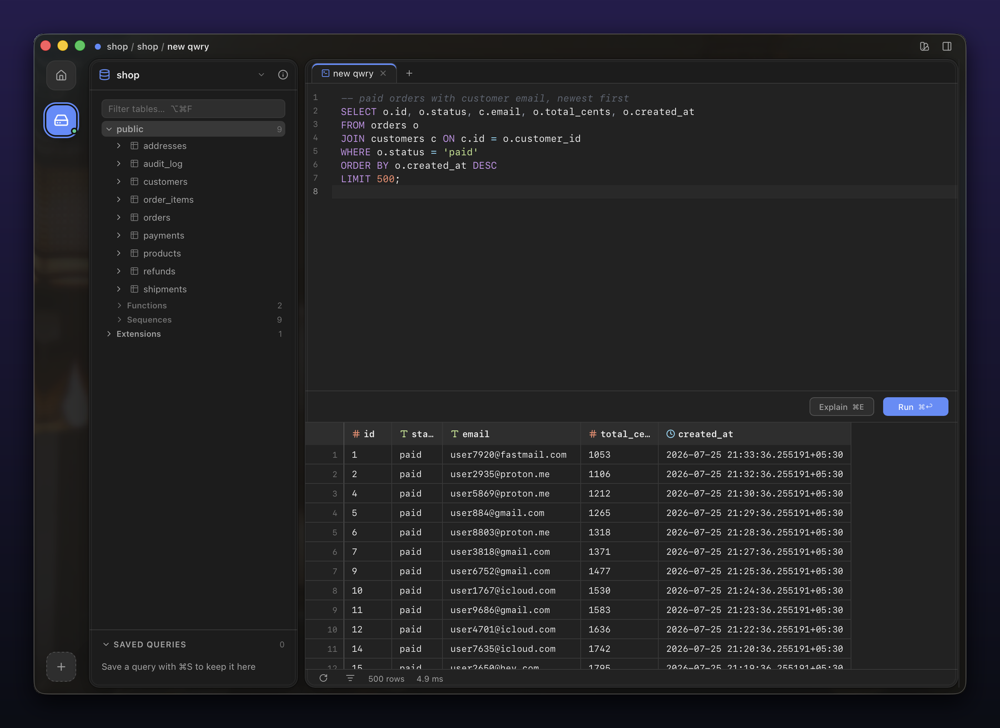
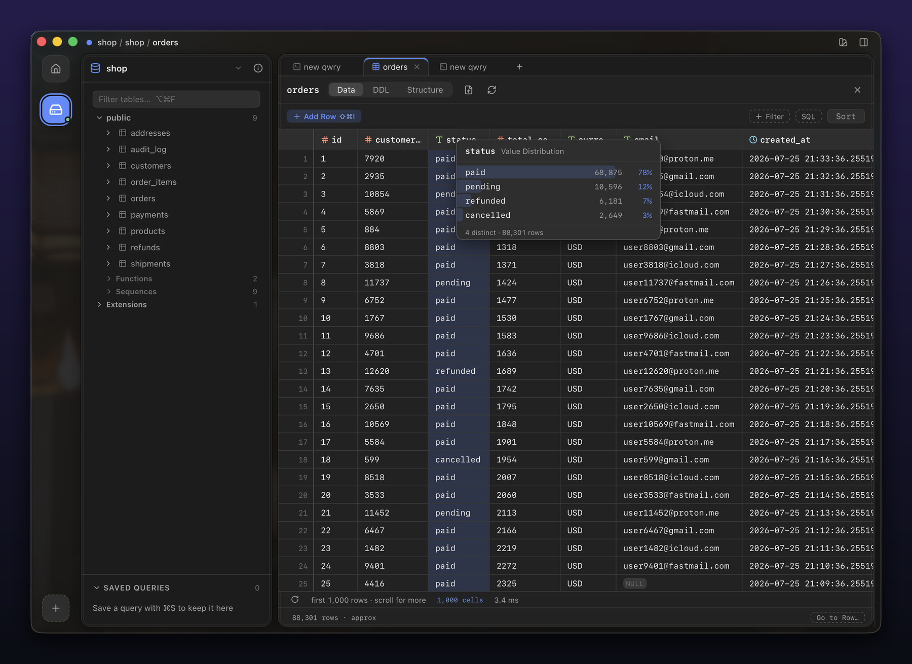
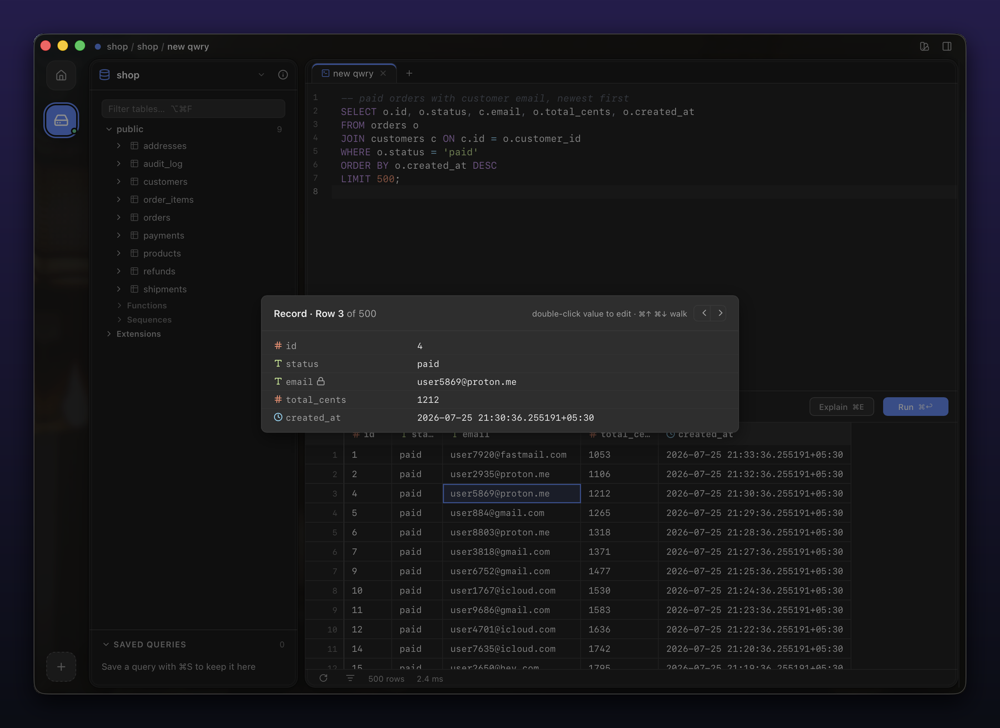
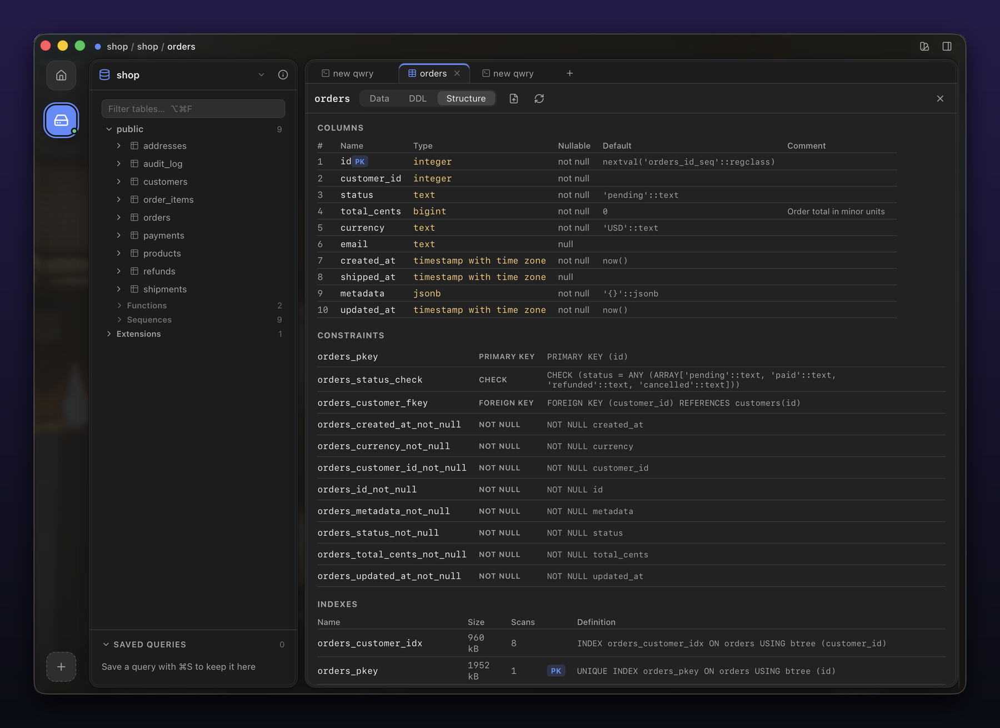
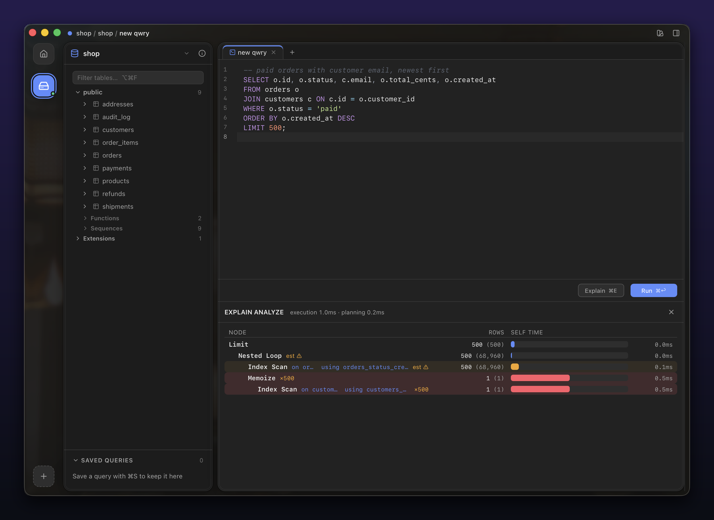
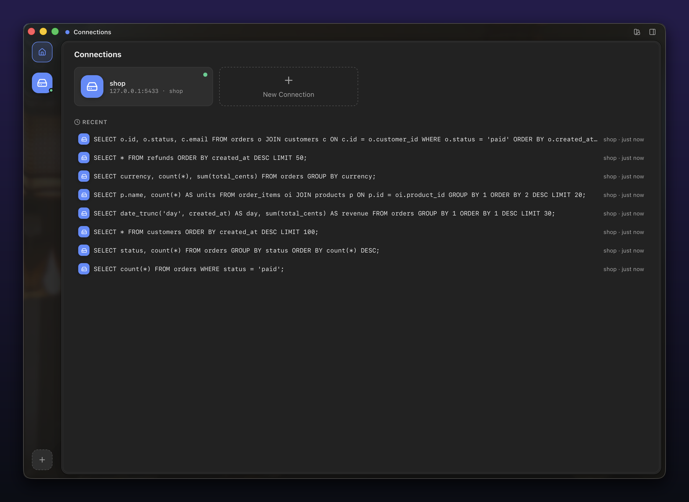
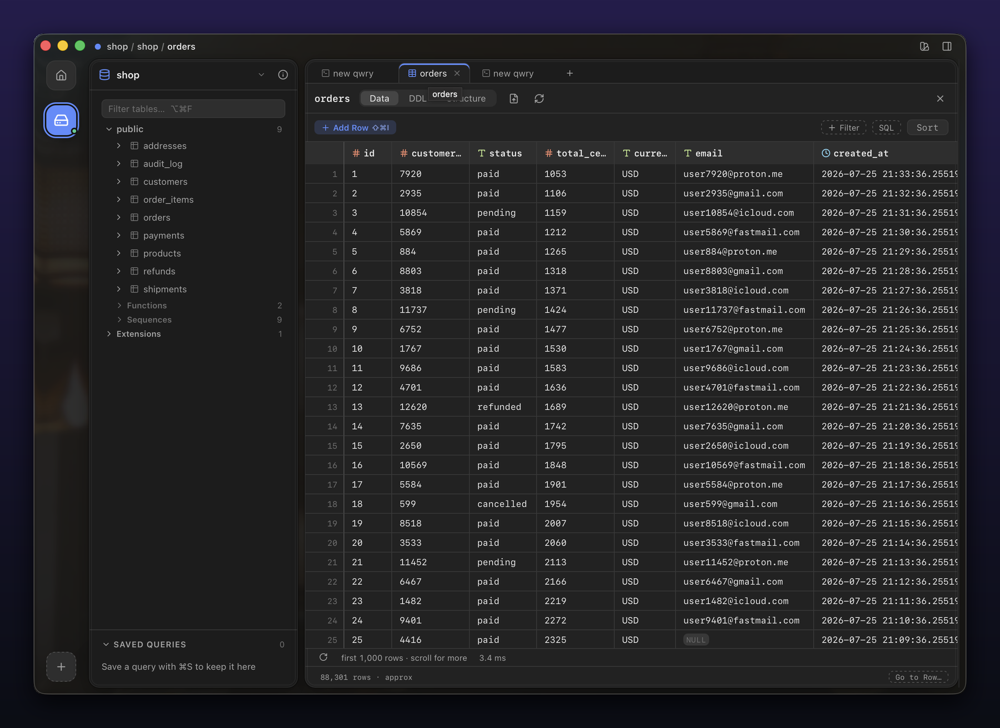
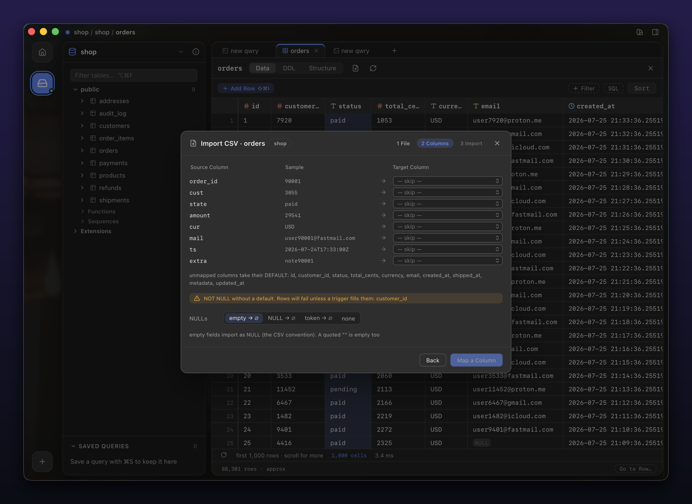
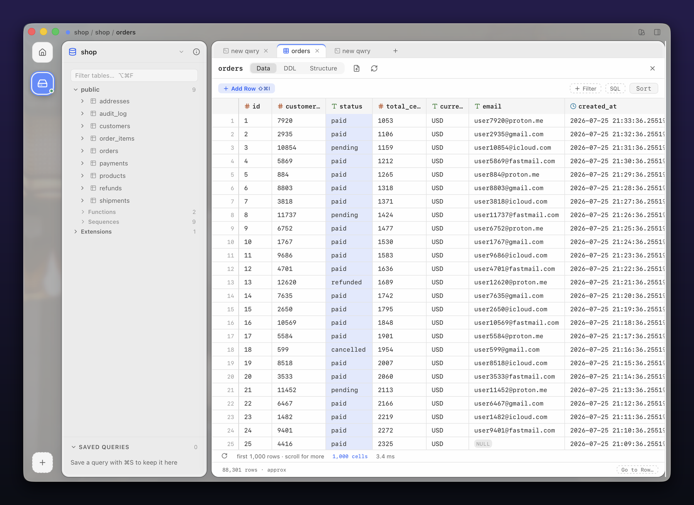

# qwry

A fast, local PostgreSQL client for macOS: keyboard-first, no telemetry, no account, no cloud.

<sub>Tauri 2 (Rust core) · React 19 · CodeMirror 6 · ~15 MB app · ~6 MB dmg</sub>

<p align="center">
  
</p>

Two invariants govern every feature:

- **Never slow, at any scale.** Cold start under 500 ms, completion under a keystroke, a million-row result scrolls at 60 fps, and browsing page 5,000 of an 8-million-row table costs the same as page 1 (keyset pagination, not OFFSET).
- **Never lie about or corrupt data.** Every write is previewed as the exact SQL it will run, verified row-by-row inside one transaction, and refused entirely (zero partial writes) if anything under it moved. Errors, truncations, and caps are always said out loud.

## What it does that others don't

- **Inverse-SQL undo after commit.** The commit transaction captures OLD values and persists a revert script; a toast offers Undo. The undo itself re-enters the same verified pipeline: a stale undo rolls back honestly instead of guessing.
- **Buffer time-machine.** Step the editor back through every executed version of the current tab (⌃⌘←/→), read-only, Enter to restore. Never lose the query that worked.
- **CTE runner.** Run one CTE out of a `WITH` chain as its own statement: debug the middle of a pipeline without dismantling it.
- **Distinct-value histograms.** A column header menu shows the value distribution of the result ("paid 78% · pending 12%") with counts, streamed and capped honestly.
- **Keyset browsing.** The table browser paginates by key, with PK (or ctid) tiebreakers: no duplicate or dropped rows under non-unique sorts, no O(n²) OFFSET cliff.
- **Record view + row diff.** ⇧Space flips a row into a transposed single-record inspector with prev/next; select two rows to highlight exactly which columns differ.
- **Verified-batch editing of any query result.** Run any SELECT, joins included; qwry maps result cells back to source tables via wire-protocol metadata, shows the exact `UPDATE … WHERE … RETURNING` before commit, and verifies each row matched exactly one target. Read-only cells tell you *why*, with the recipe to make them editable.
- **Prod safe-mode.** Connections flagged production get a persistent warning strip, a locked titlebar chip, and guards in front of destructive statements (`UPDATE`/`DELETE` without `WHERE`, streamed impact estimates).

Beyond those: FROM-scoped SQL completion with FK-aware `JOIN … ON` suggestions, per-tab dedicated connections (real `BEGIN`/`COMMIT` isolation with a transaction chip), out-of-band query cancel that a stuck session can't block, structure tab with constraints/indexes/triggers/per-table stats, multi-column sort with NULLS control, filter builder with a raw-WHERE escape hatch that shows you the SQL it built, CSV import wizard with dry-run validation and per-row error reporting, first-class JSON tree editing, `.sql` file open/save, searchable per-connection history, ⌘K palette, EXPLAIN ANALYZE visualizer, SSH tunnels via your system `ssh`, Keychain-stored credentials, and a theme engine with curated palettes.

## A closer look

<table>
  <tr>
    <td width="50%">
      
      <br><sub><b>Value distribution</b>: one menu click turns any column into a counted, percentaged breakdown of the whole result.</sub>
    </td>
    <td width="50%">
      
      <br><sub><b>Record view</b>: ⇧Space flips a row into a transposed inspector with FK/PK badges and prev/next.</sub>
    </td>
  </tr>
  <tr>
    <td width="50%">
      
      <br><sub><b>Structure</b>: columns, constraints, indexes (with size + scan counts), triggers, and per-table stats.</sub>
    </td>
    <td width="50%">
      
      <br><sub><b>EXPLAIN ANALYZE</b>: the plan as a tree, each node heat-shaded by its share of total time.</sub>
    </td>
  </tr>
</table>

## More views

<table>
  <tr>
    <td width="50%">
      
      <br><sub><b>Connections</b>: saved connections and searchable recent activity.</sub>
    </td>
    <td width="50%">
      
      <br><sub><b>Table browser</b>: keyset-paginated browse with add-row, filter builder, and sort.</sub>
    </td>
  </tr>
  <tr>
    <td width="50%">
      
      <br><sub><b>CSV import</b>: column mapping, type checks, and a dry run before anything is written.</sub>
    </td>
    <td width="50%">
      
      <br><sub><b>Light theme</b>: the full theme engine, light and dark, with curated palettes.</sub>
    </td>
  </tr>
</table>

## Install

Build from source (macOS only):

```sh
# requirements: macOS, Rust (rustup), Bun, Xcode CLT
bun install
bun run tauri build    # produces the .app and .dmg under src-tauri/target
```

`bun run tauri dev` runs the app with hot reload.

### "qwry is damaged and can't be opened"

It isn't. That's Gatekeeper's phrasing for "this developer hasn't paid Apple $99 a year," which is a fair description of me. If you got the `.dmg` from someone instead of building it yourself, macOS quarantined it on the way in. Free it:

```sh
xattr -d com.apple.quarantine /Applications/qwry.app
```

If that still complains, clear every extended attribute on the bundle:

```sh
xattr -cr /Applications/qwry.app
```

Then open it normally. Once is enough — the flag doesn't come back. A notarized build ships the day the Apple Developer Program stops costing more than the app does.

## Architecture

The Rust core (`src-tauri/src/`) owns everything that touches a database. A `DbDriver` trait fronts the PostgreSQL implementation, which speaks tokio-postgres over the **simple protocol** so every value arrives as psql-identical wire text, with no lossy client-side type conversion. Results stream to the frontend in batches over Tauri channels. The driver tracks transaction state authoritatively, cancels queries out-of-band (`pg_cancel_backend` from a fresh connection, so a busy session can never block its own cancel), and derives editability maps from `prepare()` metadata. Around it: SSH tunnels via the system `ssh` (honours `~/.ssh/config`), credentials in the macOS Keychain, and app state in SQLite with numbered migrations.

The frontend (`src/`) is React 19 with zustand stores, a CodeMirror 6 editor driven by a custom completion engine on lezer, and a hand-rolled virtualized grid on TanStack Virtual. All motion goes through spring presets; all styling through the token system in `src/design/tokens.css`. Perf budgets are enforced, not aspirational: cold start < 500 ms, keystroke-to-completion < 16 ms, 60 fps grid scroll minimum.

The `docs/` directory is the project's memory. `ARCHITECTURE.md` is the design truth, `ROADMAP.md` holds the phase plan plus a dated session log of what was built and every gotcha hit along the way, `DECISIONS.md` is an ADR-lite ledger, and `GAPS.md` tracks known debt. Development happens wave-by-wave (implement, gate, adversarial audit, ship) and the docs are updated in the same wave, always. Read them first if you're contributing.

## Development

```sh
source ~/.cargo/env              # Rust toolchain (required every shell)
bun install                      # frontend deps
bun run tauri dev                # run app (dev, hot reload)
bun run tauri build              # release .app/.dmg
cd src-tauri && cargo check      # fast Rust typecheck
cd src-tauri && cargo clippy     # lint
bunx tsc --noEmit                # TS typecheck
```

Backend integration tests run live against a real PostgreSQL database you control. Point them at a disposable development database, **never production**:

```sh
QWRY_TEST_HOST=… QWRY_TEST_USER=… QWRY_TEST_PASSWORD=… QWRY_TEST_DB=… \
  cargo test --test staging_smoke -- --ignored
```

Some suites use a second, writable database (`QWRY_TEST_DB2`) for DDL-creating fixtures; those confine themselves to a `qwry_test` schema and drop it at teardown.

PostgreSQL only for now (the driver trait is in place for SQLite/MySQL later). macOS only.

## License

Released under the [Apache License 2.0](LICENSE). Copyright (c) 2026 Manish Gudewar.
